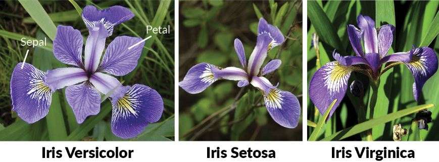

# Project 2020 - The Iris flower data set 

# Introduction 

The Iris data set or fishers iris data set is a multivariable set introducted by biologist Ronald Fisher in 1939. The use

The data set is based on the 3 species of the Iris Flower and consists of 50 samples of each species: 

     Iris Setosa, Iris Virginica and Iris Versicolor. 

The data set contains 5 varaibles; sepal length, sepal width, petal length, petal width and species, with 150 rows of data, measured in centimeters. 

It is from the data recorded under the length and width of the sepal and petal that determines the type (species) of the Iris flower.

The dataset is an example of linear discriminant analysis (LDA) which is a method used in statistics,  pattern, recognition, and machine learning to find a linear combination. 

The species Iris Setosa is linearly separable from Iris Versicolor and Iris Versicolor, however these two species are not linear separable, as a portion of Iris Virginica is mixed with Iris Versicolor. 

Iris data set - Wikipedia:

https://en.wikipedia.org/wiki/Iris_flower_data_set#Data_set

Iris data set used for this project: 

http://archive.ics.uci.edu/ml/datasets/Iris

NB: The data set downloaded from the UCI website contains two errors. I have manually corrected both errors within the txt file used. Please refer to the wikipedia website above regarding same.  

# Iris Flower Species 

 
# Installations 

The following software and tools were installed

- Anaconda
- Cmder
- Visual Studio Code

# Objectives 

- Research the dataset online and write a summary about it
- Download the Iris dataset and add to your repository
- Write a program called analysis.py that:
- - outputs a summary of each variable to a single file 
- - saves a histogram of each variable to png.file
- - outputs a scattered plot of each pair of variables 

# Content 

- analysis.py 
- output.txt (contains the summary of each variable)
- Image.jpg (Iris flower Image)
- scatter plots.png files 

# Description 

**Downloading dataset**

I downloaded the data set from the UCI wedsite and saved it to text file (link above). The dataset consists of 150 rows of data and 5 columns. Row; 50 samples from each of the three species (iris setosa, Iris Virginica and Iris Vericolor). Columns; the first four columns contain measurements in centimeters of the sepal length, sepal width, petal length and petal length, with the last column assigning the type of species.

**Importing Libraries**

- **import pandas as pd** ; provides objects such as Dataframes which are useful when analysing data.
- **import sys as sy** ; system-specific parameter and functions. Used in this project for redirecting print output to a text file. 
- **import matplotlib.pyplot as plt**; is a ploting libery for python.
- **import numpy as np** ; provides objects for multi-dimensional arrays.
- **import seaborn as sns**; is a data visualization liberty based on matplotlib.

**Reading the dataset**

The text file did not include column headings, i created a variable called 'col' to assign headings to the dataset and another variable called 'd' which  assigns the data to the pandas dataframe with pd.read_csv reading the text file.

     col = ['sepal_length', 'sepal_width','petal_length', 'petal_width','species']

Reading the file, assigning data to the dataframe and including the column headings: 

     d = pd. read_csv ("iris.txt", names=col)

To ensure the variables were working correctly I run the code in commandline, which did produced the full contents of the text file. The next step is creating an output summary of the dataset to a single text file. In order or me to do this, I to create a new file called 'output.txt' and saved this to my current directory. I'am able to open and write to the text file by using the import 'sys' and assigning 'stdout (standard output). This will redirect printed commands to the output.txt file. 

     sy.stdout = open("output.txt", "w")

sy.stdout reference: https://kite.com/python/answers/how-to-redirect-print-output-to-a-text-file-in-python 

        

