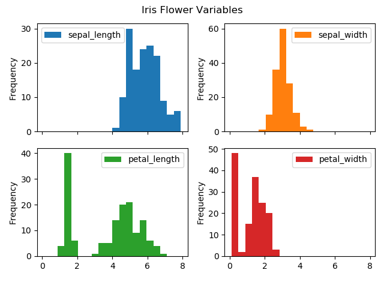

# Project 2020 - The Iris flower data set 

# Introduction 

The Iris data set or fishers iris data set is a multivariable set introducted by biologist Ronald Fisher in 1939. The data set is based on the 3 species of the Iris Flower and consists of 50 samples of each species: 

***Iris Setosa, Iris Virginica and Iris Versicolor.*** 

The data set contains 5 varaibles; sepal length, sepal width, petal length, petal width and species, with 150 rows of data, measured in centimeters. It is from the data recorded under the length and width of the sepal and petal that determines the type (species) of the Iris flower.

The dataset is an example of linear discriminant analysis (LDA) which is a method used in statistics,  pattern, recognition, and machine learning to find a linear combination. The species Iris Setosa is linearly separable from Iris Virginica and Iris Versicolor, however these two species are not linear separable, as a portion of Iris Virginica is mixed with Iris Versicolor. 

Iris data set - Wikipedia:

https://en.wikipedia.org/wiki/Iris_flower_data_set#Data_set

LDA - wikipedia:

https://en.m.wikipedia.org/wiki/Linear_discriminant_analysis 

Iris data set used for this project: 

http://archive.ics.uci.edu/ml/datasets/Iris

NB: The data set downloaded from the UCI website contains two errors. I have manually corrected both errors within the text file used. Please refer to the wikipedia website above regarding same.  

# Iris Flower Species 

 
# Installations 

The following software and tools were installed

- Anaconda
- Cmder
- Visual Studio Code

# Objectives 

- Research the dataset online and write a summary about it
- Download the Iris dataset and add to your repository
- Write a program called analysis.py that:
- - outputs a summary of each variable to a single file 
- - saves a histogram of each variable to png.file
- - outputs a scattered plot of each pair of variables 

# Content 

- analysis.py 
- output.txt (contains the summary of each variable)
- Image.jpg (Iris flower Image)
- scatter plots.png files 

# Description 

**Downloading dataset**

I downloaded the data set from the UCI wedsite and saved it as a text file (link above). The dataset consists of 150 rows of data and 5 columns. Row; 50 samples from each of the three species. Columns; the first four columns contain measurements (in centimeters) of the sepal length, sepal width, petal length and petal length, with the last column assigning the type of species (iris setosa, Iris Virginica and Iris Vericolor).

**Importing Libraries**

- **import pandas as pd** ; provides objects such as Dataframes, which are useful when analysing data.
- **import sys as sy** ; system-specific parameter and functions. Used in this project for redirecting print output to a text file. 
- **import matplotlib.pyplot as plt**; is a ploting library for python.
- **import numpy as np** ; provides objects for multi-dimensional arrays.
- **import seaborn as sns**; is a data visualization liberty based on matplotlib.

**Reading the dataset**

The text file did not include column headings, I created a variable called 'col' to assign headings to the dataset and another variable called 'd' which  assigns the data to the pandas dataframe with pd.read_csv, and reads the text file.

     col = ['sepal_length', 'sepal_width','petal_length', 'petal_width','species']

Reading the file, assigning data to the dataframe and including the column headings: 

     d = pd. read_csv ("iris.txt", names=col)

To ensure the variables were working correctly I run the code on the command line , which did produced the full contents of the text file. The next step is creating an output summary of the dataset to a single text file. In order or me to do this, I created a new file called 'output.txt' and saved this to my current directory. I open and write to the text file by using the import 'sys', assigning 'sy.stdout' (standard output), will redirect printed commands to the output.txt file. 

     sy.stdout = open("output.txt", "w")

sy.stdout reference: https://kite.com/python/answers/how-to-redirect-print-output-to-a-text-file-in-python 

**Pandas built in functions**

By using the **Pandas** built in functions I was able to efficiently create the summary of the data.
Note as I'm saving the printed command to the output.txt file i use "string" and the character "\n" (creates a newline), to provide a cleaner visualization of the data. The following built in functions were used: 

- **DataFrame.groupby().size ()** - groupby(); used to split the data into groups, size();returns the number of values in the data. Here I grouped the data by 'species' including size.

          print("SUMMARY OF DATA: ", "\n", d.    groupby('species').size(), "\n")

- **DataFrame.shape** - returns a tuble of the shape of the data i.e the amount of rows and columns.

          print("Count of Columns and Rows: ", d.shape,"\n")

- **DataFrame.head** - returns the first few rows of data. As you will see, I have specified the first 10 rows.

          print("Sample of Data: ", "\n", d.head(10),"\n")

- **DataFrame.Description** - returns the Count, Means, Std, Min, Max, lower and upper percentile. i have also included the list of columns I want to display "d[d.columns[0:]]".

          print("Description of Data: " "\n", d[d.columns[0:]].describe())

 - **Pandas set_options** - this was required as not all columns were displaying on the printed command.

          pd.set_option('display.max_rows', 10) 
          pd.set_option('display.max_column', 5)

Lets take the printed output of 'Description of data': 

      Description of Data: 
          sepal_length  sepal_width  petal_length  petal_width
     count    150.000000   150.000000    150.000000   150.000000
     mean       5.843333     3.057333      3.758000     1.199333
     std        0.828066     0.435866      1.765298     0.762238
     min        4.300000     2.000000      1.000000     0.100000
     25%        5.100000     2.800000      1.600000     0.300000
     50%        5.800000     3.000000      4.350000     1.300000
     75%        6.400000     3.300000      5.100000     1.800000
     max        7.900000     4.400000      6.900000     2.500000

So what does the above tell us; from analysing the data, instantly is it clear the medium sepal length of all species combined is longer than the petal length, with the sepal width wider than the petal width. Looking at min and max it is clear the sepal minumum length is 4.3 cm with the maximum length 7.9 cm, the petal length ranging from 1.0 cm to 6.9 cm. The sepal width ranges from 2.0cm to 4.4 cm and petal width ranging from 0.1cm to 2.5 cm. The percentile 50% displays the percentage of data within that range. The summary above provides a description of all species combined so you cannot distinguish from species here. 

 

Reference: https://pandas.pydata.org/pandas-docs/stable/reference/api/pandas.DataFrame.html 

**Histogram of each variable**

One of the objectives of the project is saving a histogram of each variable to png.file. Upon researching histograms I discovered "Subplots" using the library **Matplotlib**. I have two ways of producing the data 1. Write a code for each variable to display separate histograms, saving to four separate png files 2. Write one piece of code that will display a histogram of each variable to one png.file. I choose the latter as the subplot provides the same date without having to repeat code, with reference to one png.file. 

**Histogram code**

    d.plot.hist( subplots=True, bins=12, layout=(2,2))
     plt.suptitle("Iris Flower Variables", fontsize = 12) 
     plt.tight_layout(rect=[0, 0.03, 1, 0.95])
     plt.savefig("Histogram.png")
     plt.show()

**Histogram Output**

        

